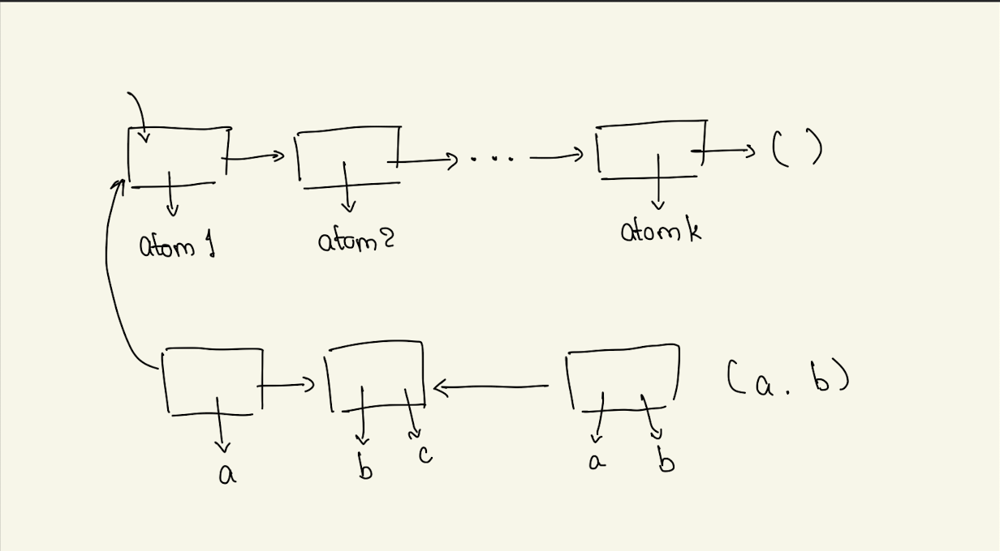

## Class - CSc 335

## Date - April 18, 2023 (Tuesday)


display as `(atom1, atom2,...,atom k)` and can be created in a number of ways eg.

```scheme
'(atom1, atom2,...,atom k)
(list atom1, atom2,...,atom k)
```

Data described y (finite list of sexp)

```
sexp :: = atom | () (cons sexp sexp)|
                    Not the same as
                    (sexp...sexp)
```

We want a program $lat?$ which checks whether an sexp `s` is a lat, where

```
lat :: = () | (cons atom lat)
                is this okay or do we want
                (atom ... atom)?
```

MAIN IDEA: Structure of a program, which processes sexp must mirror the structure of sexps.

```scheme
(define (lat? sexp)
  (cond ((null? sexp) #t)
        ((atom? sexp) #f)
        (else (and (atom? (car sexp))
                   (lat? (cdr sexp))))
        ))
```

$lat?$ is supposed to be a function from sexp to B - the set `{#f, #t}`

Several inductive descriptioin are possible

1. Induction on the length of the sexp, where we agree that the length of an atom is 0.
2. We do induction on the number of cons.
3. Leverage the BNF definitioin of sexp as also a definition of `component` of an sexp, and then use `structural induction`.

Recall: The IH for a structural induction is to assume the result holds for all proper components of the input.

```scheme
(define (member? a lat)
  (cond ((null? lat) #f)
        ((eq? a (car lat)) #t)
        (else (member? a (cdr lat)))))
```

**Induction Proof**

- Easily given, say by induction on the length of lat.

**What is GI?**

- A possible GI

  - $a \in LAT \iff a \in lat$

- **Strong enough?** We need to check that GI & stopping condition $\implies$ post condition.

```scheme
GI && ((null? lat) OR ((car lat) = a)) => returns #f
```

- because $GI \ and \ (null? \ lat) \implies a \notin LAT$
- **Preserved?\_**
  - we assume GI true on current call. So the only way $a \in LAT$ is either
    1. $a = (car \ lat)$ or
    2. $a \in (cdr \ lat)$
- pre: a is an atom, lat is a lat
- post: returns $a \in lat$

remove an occurence of a from l, leaving l otherwise unchanged.

we are removing the first occurence

As often happens the program is over specified relative to the spec.
