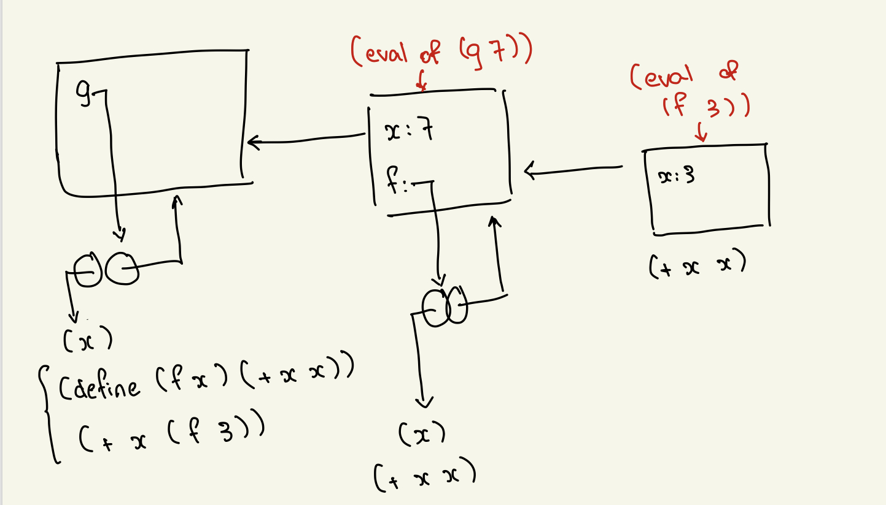
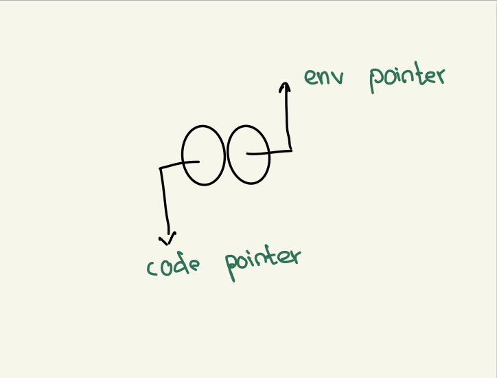
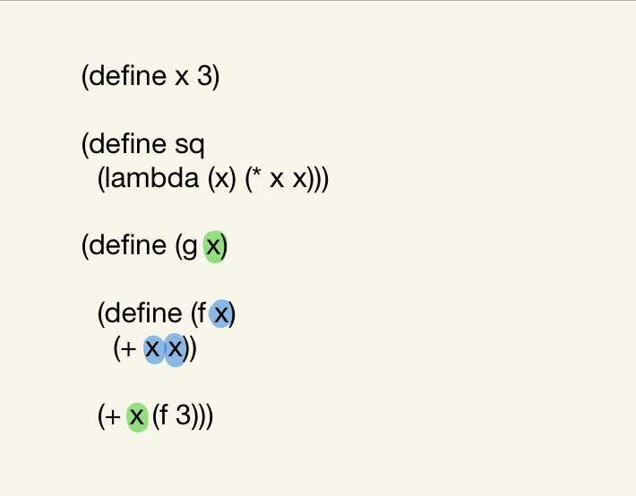
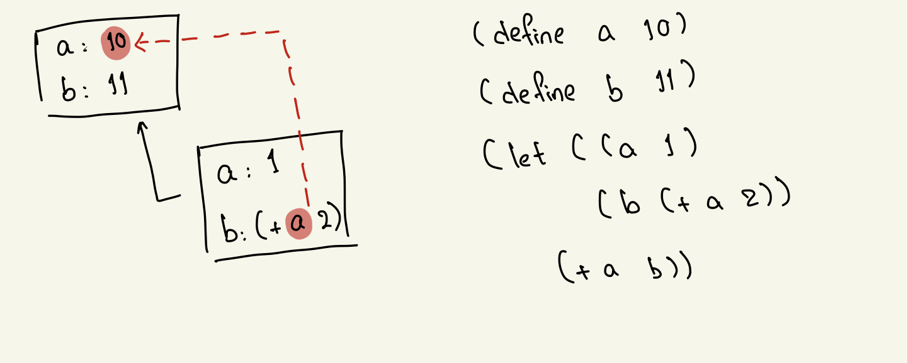
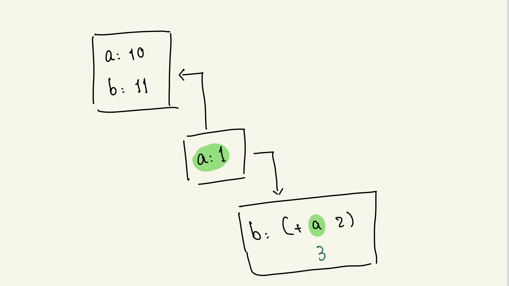

### Class: CSc 335
### Date: Feb 7, 2023

#### Environment Diagram 
- The new frame will always point to the frame that contains the evaluation func 

- Pointers in the environment diagram 

- example code on which `x` is bound to which


#### COND (RESERVED KEYWORD)
```scheme
(cond (q1 a1)
      (q2 a2)
      (q3 a3)
      (qn an)
        |
        |
        |
      (else a-else))
```
- The `q-i` are 'questions" [i.e. boolean valued scheme expressions] and the `a-i` are "answers" => arbitrary scheme expressions. 

`if` can be expressed via `cond`
```scheme
(if x y z) === (cond (x y)
                     (else z))
```
- `x` is the condition 
- `y` will return if `x` is true else `z` will return.

**Can `cond` be used to express `and` ?**
```scheme
(and x y) === (cond (x y)
                    (else #f))
```

From the notes on `let`
```scheme
(define a 10)
(define b 11)
(let ((a 1)
      (b (+ a 2)))
  (+ a b))
```


- `let` constracts with `let*` (iterated let)

```scheme
(let* ((a 1)
       (b (+ a 1)))
  (+ a b))
```
is equal to the following 
```scheme 
(let ((a 1))
  (let ((b (+ a 1))))
  (+ a b))
```

