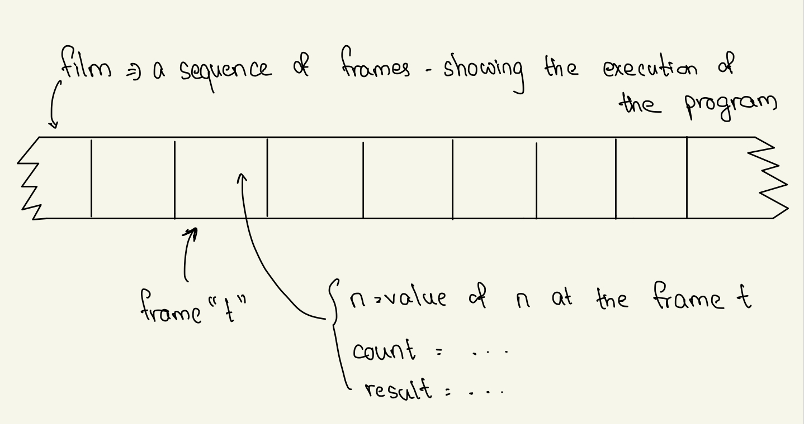

## Class: CSc 335 
## Date: Feb 16, 2023 (Thursday)

### Invariant

```
[inv && stopiing-cond] => post condition
```

```
result = count! && count = n => result = n!
```

- Because discovering invariants can be challenging, suggested to keep in mind in the right place by first seeking `a guess-invariant (GI)`
- Starting with the GI, we subject to 3 tests in an effort to refine the GI so that it is in fact an invariant. 
- These tests are what define an invariant.

### Invariant Test Suggested Order
1. Is GI strong enough? 
    - i.e. Is the implication valid?
    ```
    [GI && stopping-condition] => post-condition
    ```
    - (This is an implication of the same kind discussed in the discrete math class.)
    - **If it fails the first time, it's not worth continuing and not worth the time**

<h2><b>NOTE: What does "standard implication" mean?</b></h2> 

- The implications must be shown true without reference to the run time history of the program. They must be `static implication`. 

2. Is it weak enough? 
    - i.e. Is the GI true the first time the first the iterative procedure is called? 
    - [example of a GI which is strong enough but not weak enough - result in n!] &rarr; for fact-iter func
    ```
    Recall A && B => A is a valid implication
    ```
3. (Mostly connected to the code written) Is it preserved 
    - i.e. if GI holds on the current call, does it hold as well for the next?
    - Assume `result = count!` on the current call to `fact-iter`. Does the same equation hold on the next call?
    - We look at the body of the `fact-iter`: on he next call, we need 
    ```
    (* (+ count1) result) = (+ count1)!
    ```
    - Put in `count!` for result - and see that this is true.

### Pictorial idea for invariant 

- The invariant's job is to describe one of these frames at a typical intermediate point in the execution of the program. 
- You don't need to unwind the loop 
- Recursive program &rarr; assume the result you will get to it 
    1. only at the extreme case 
    2. only look at the points in between 

### HW 3 
- largely concerned with mechanic codes 
- it's an introduction to `divide and conquer`