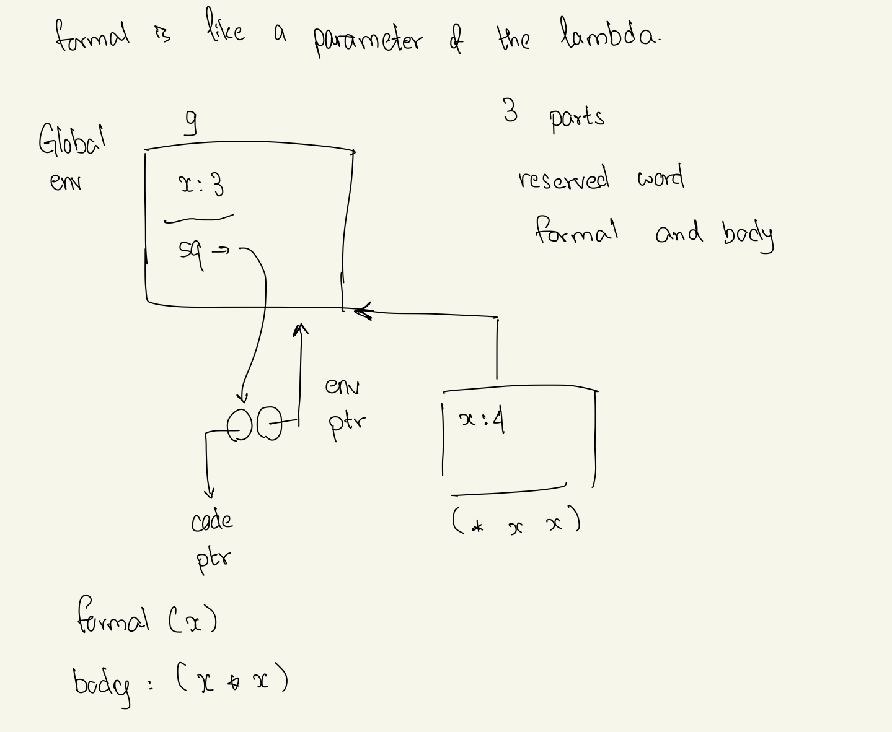
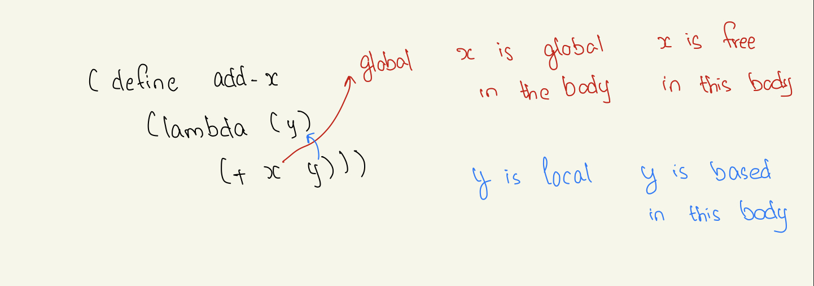
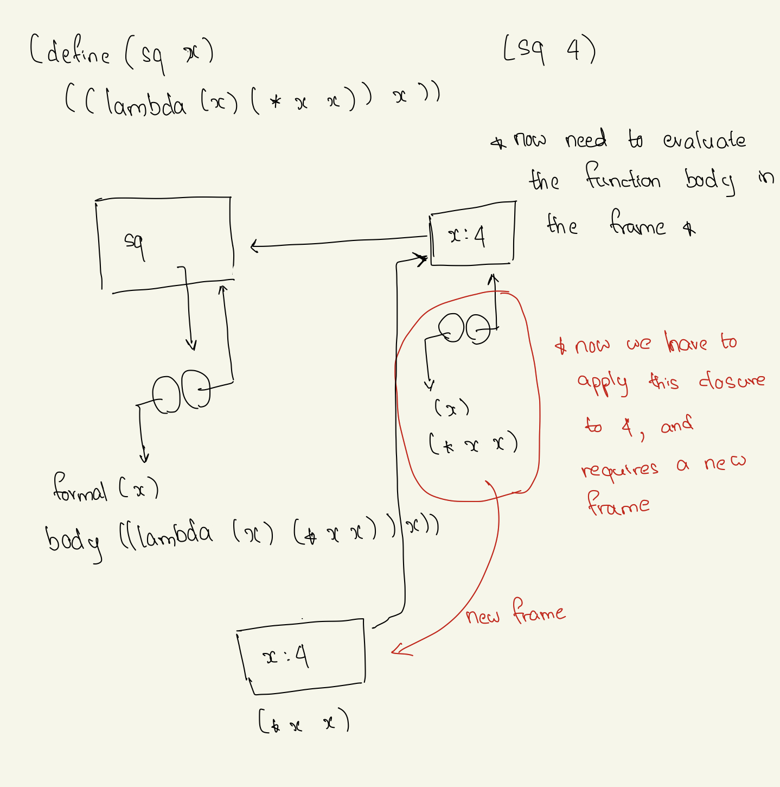

### Class: CSc 335 
### Date: Feb 2, 2023 (Thursday)

#### QUIZ NEXT THURSDAY 
- Enbironment diagram 

#### Lambda Function
- creating a closure 
    - closure has `3` parts &rarr; reserved word, formal and body
```
(lambda (x) (* x x))
> #<procedure>
```
- to use lambda 
```
((lambda (x) (* x x)) 8)
> 64 
```
- with two parameters 
```
((lambda (x y) (+ x y)) 3 4)
> 7
```

- When you use define, you're installing variables in global env (knows all about scheme, but not about x or sq.)

| Global Env | Define | 
|:--:|:--:|
| x: 3 | (define x 3)
| sq &rarr; ? | |

(define sq (lambda (x) (* x x))) &rarr; creates a closure



- A&S use a `sugared` form of function definition 
```
eg. (define(sq x) (* x x))
```

**QUESTION: What happens when (sq 4) is evaluated, given g as shown?**

**ANSWER:**
1. Create a new frame with the same enclosing frame as `sq`
2. In the new frame, bind the formal parameter `x` to the value of the actual parameter `4`. 
3. Evaluate the body of `sq` in the frame. This evaluation entails same lookups 
    - `*` is not defined in the new frame so the system looks in the containing frame and finds the primitive x. 
    - Take the first value of x found in any of the enclosing frames &rarr; in this case, `4`. Note that `x=3` in `g` is ignored for this evaluation &rarr; one says that it is `shadowed`. (This is the essence of the implementation of local variables)
4. The value `(* 4 4) = 16` is returned. 
5. Next `Garbage collector` kicks in &rarr; it stores the newly allocated frame (memory) to the keys because there's no directed path from `g` to `the new frame`. The contents of the new frame  are immediately inaccessible or disappeared. 

#### Functions 
- functions in scheme are `First Class`
    - can be returned by a function call
    - can occur in data structure &rarr; we can, for example, have lists of functions 
 


**QUIZ ON THURSDAY FEB 9**
- Environemnt diagram for sure

