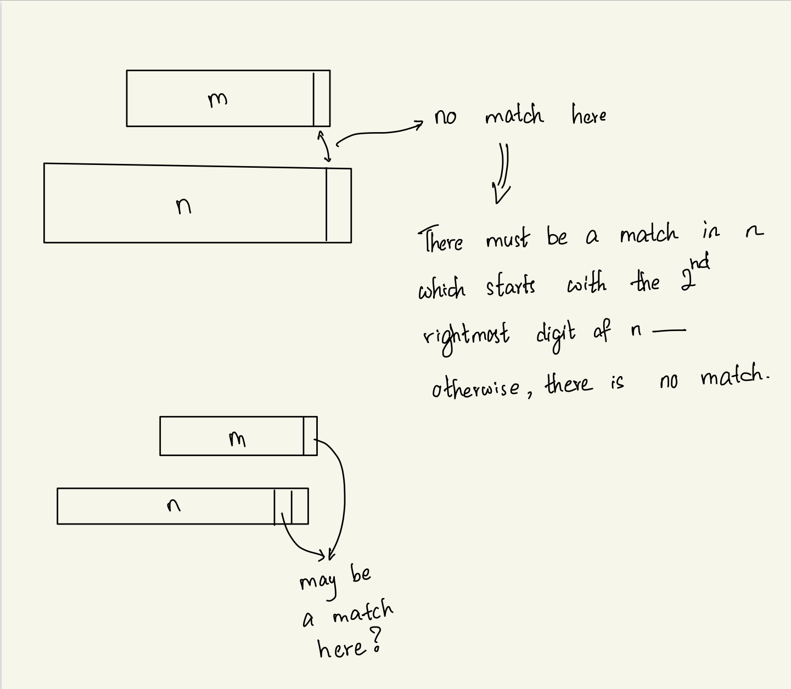
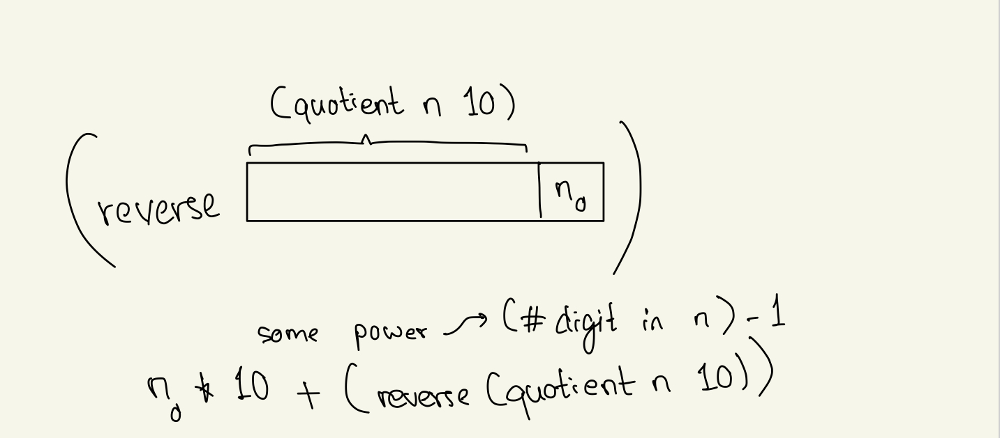

## Class: CSc 335 
## Date: Mar 2, 2023 (Thursday)

### AM Quiz problem without the multiplicity restriction

- Let's write m $\subseteq$ n to abbreviate `(contains? n m)`
- We want, e.g. 333 $\subseteq$ 3 to be true - essentially the mapping requirement we imposed on the first solution, but without the one-to-one requirement.
- Again, let $m_0$ be the rightmost digit in m and $n_0$ the rightmost digit in n. 

What do we learn by comparing $m_0$ and $n_0$?
-----------------------------------------------
- if $m_0 = n_0$, then m $\leq$ n iff `(quotient m 10)` $\leq$ n OR if m < 10
- if $m_0 \neq n_0$, then just as for the first solution we see that no "m-pattern" can begin with $n_0$, so m $\leq$ `(quotient n 10)`
    - i.e., there exists a possibly many-to-one mapping from the digits of $m$ to those of $n$. 

This may be all we need to say about divide & conquer, but we still must address the stopping condition(s).

_____
What if $n < 10$, so $n = n_0$, and yet $n_0 \neq m_0$? 
- Must in this case return `#f` - $m \leq n$ is not true.
_____
We maintain an open mind as regards the stopping condition(s).
_____

Code: 
- pre-condition: $m, n \geq 0$ are integers, 
- post-condition: $m \subseteq n$

```scheme
(define (contains? m n)
  (let ((m0 (modulo m 10))
        (n0 (modulo n 10)))
    (cond ((= m0 n0)
           (if (< m 10)
               #t
               (contains? (quotient m 10) n)))
          (else (contains? m (quotient n 10))))))
```
- why not just `(or (< m 10) (contains? (quotient m 10) n))`? 
    - should this call be evaluated first, and m is in fact < 10, could get incorrect result?

Test
-----
- Worry even before testing about termination, because there is no explicit basis case shown in the code

-----
PM Class Quiz 2 
---
Input $n \geq 0$ an integer and a digit d and return the number obtained from n by removing the left-most occurence of d. 
```
eg. (remove-leftmost 121314 1) = 21314
```
**NOTE: $n \neq d$ should be added to pre-condition. Anything else?**

1. One design would make use of a function reverse-digits and then to remove the rightmost occurence of d, and then to reverse again: 121314 &rarr; 413121 &rarr; 41312 &rarr; 21314. 
    - Note: removal of rightmost d is easy. 

2. Another design: scan n from the right, making use of a function 
- `(occurs? n d) which determines whether d occurs in n. 

```scheme
(defne (remove-leftmost n d)
  (cond ((= d (modulo n 10))
         (if (not (occurs? (quotient n 10) d))
             (quotient n 10)
             (+ (modulo n 10)
                (* 10 (remove-leftmost (quotient n 10) d)))))
        (else (+ (modulo n 10)
                 (* 10 (remove-leftmost (quotient n 10) d))))))
```

- Please use let to remove the overuse of quotient and modulo for repeated tasks. 

What about `(occurs? n d)`?
- an iterative design idea: scan n from the right 

- GI: d occurs in n ifff d occurs in not-yet-processed (nyp)

Design Idea for Reversing n: 
