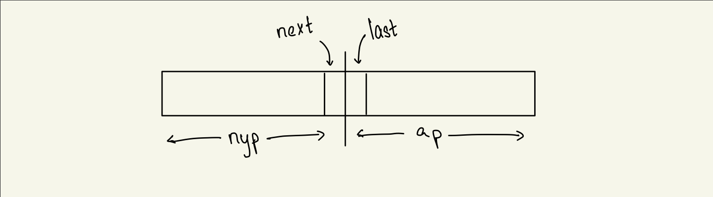
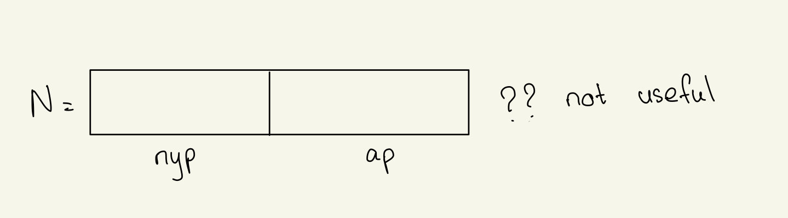

## Class: CSc 335
## Date: Mar 14, 2023 (Tuesday)

Is the GI (program) we presented last night as simple as it might be? specifically it seems that the `sorted-so-far?` boolean is an artifact of the invariant-based development technique - and if it clutters the code unnecessarily, we'd do well to eliminate it. 

How about something like this code

```scheme
(define (iter nyp next last)
  (cond ((zero? nyp) #t)
        ((<= next last)
         (iter (quotient nyp 10)
               (modulo (quotient nyp 10) 10)
               next))
        (else #f)))
```
___What is invariant?___
- $n = nyp * 10^{numOfDigitsInap} + ap$ &&
- ap is sorted


____
Sorting 
---
___Selection Sort___

**Note:** Which ordering? let's design for $\leq$ left to right
1. Extract the largest digit d from n, leaving the number formed by removing d
    - call this extract parameters = n and returns n without d
    - Some further thoughts 
    - It may be easiest to do what we are calling "extract" in 2 steps 
        1. Find the largest digit
        2. remove the right-most occurence of the digit
2. Recursive idea 
    - [sorted n without d] * 10 + d 
    - something like 
    ```scheme 
    (ssort (extract n)) * 10 + d
    ```
3. Iterative idea 
    - always bear in mind "result-so-far"
    
        - This drawing gets us off on the wrong foot - because it is the SET of digits in N that we care about, and not the numeric value of N. 
        - Would not be an accurate portrayal of the "extract and assemble" approach, because "result-so-far" will consist of the "largest digits" found so far, in sorted order, and these digits - the already extracted ones - was probably not rightmost in N 
    - Can we use this observation to simplify the extraction process? 
    - Design Idea: 
        - digits in N = digits remainig $\uplus$ digits already extracted
            - $\uplus$ = MULTISET UNION
        - rsf $\equiv$ digits already extracted in sorted order

__Extraction Process__

### findMaxDigit
- A simple recursive design would defer calls to `max`
- the returned value would be 
```scheme
(max (findMaxDigit (quotient n 10) (modulo n 10)))
```
- Need to handle the $n<10$ case separately

### removeMaxDigit
- input n and a max digit in n (d)
- idea: remove rightmost occurance of d (leaving a number)
- Iterative:
    - scan right to left until first d is found 
        - picture 
        - once d is found return $nyp * 10^{count} + ap$
- Recursive: 
    - if rightmost is d, return `(quotien n 10)
    - otherwise, (removeMaxDigit (quotient n 10) * 10) + (n moudlo 10)

## MULTISET VS SET 
- {1, 1, 2, 3, 3, 3} vs {1, 2, 3}
- One speaks of the underlying set of a multiset

How to return 2 values from a procedure? 
- Use prime number: the pair $(p, q)$ could be returned as $ 2^p \ 3^q$