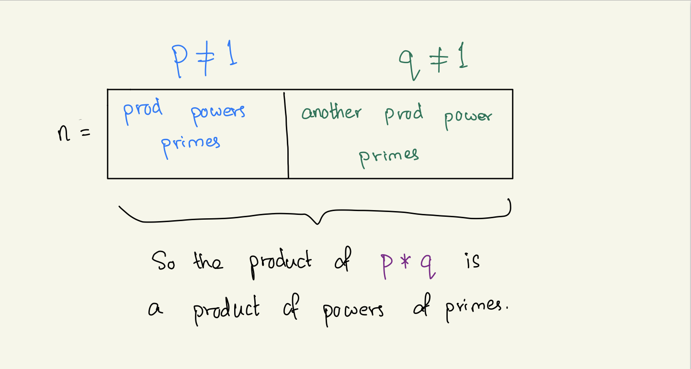

## Class: CSc 335 
## Date: Mar 7, 2023 
_____
___Strong induction___
---
Motivation: We will need strong induction when we begin discussing data strctures.

Prove: every integer $ n \geq 2 $ can be written as a product of powers of primes (proof by strong induction)

Try inducting on `n`, with divide & conquer: if $ n = p * q $, with neither `p` nor `q` equal to 1. Then assume `p` is a product of powers of primes and also that `q` is a product of powers of primes. 

Now that we have the divide & conquer strategy, here is the full argument
- Consider $ n \geq 2 $
    - If $ n = 2 $, there's nothing to show, since $ 2 = 2' $ is a product of powers of primes. 
- Consider $ n > 2 $
    - Either `n` is prime or not `n` i.e. composite
    - If n is prime, we're done. 
    - Otherwise, $ n = p * q $ for some integers $ p, q > 1 $ [def. of composite number]
    - Now the argument is the one we just gave. 



This is a strong induction because 
1. We know neither `p` nor `q` is $ n-1 $
2. We don't know in advance the values of the factors `p` and `q` - So we actually need all of the hypotheses.

____

___Tree Recusion___
---

```scheme
;; Fib-sequence

(define (fib n)
  (cond ((zero? n) 0)
        ((one? n) 1)
        (else (+ (fib (- n 1)) (fib (- n 2))))))
```

- a cool technique is `memoization` &rarr; `to transform the results of a function into something to remember`
    - example: creating a dictionary to remember the value of `fib 2` or `fib 3` in computing `fib 5`

What about an iterative solution?
---
A design idea flows from the def of $ fib(n+1) $ as $ fib(n) + fib(n-1) $ when $ n \ngeq 2 $. where
```
fib(n+1) = fib(n) + fib(n-1)
  |          |        |
 next    =  curr  +  prev
```
If we introduce `curr` and `prev` as variables with design roles: 
```scheme
curr = (fib n)
prev = (fib (- n 1))
```
with the idea of maintaining these with as count increases from $0$ up to $n$. 

i.e.: Take the GI as the logical AND of the design roles: 
- GI: 
```
next = curr + prev 
where next = fib(count)
```