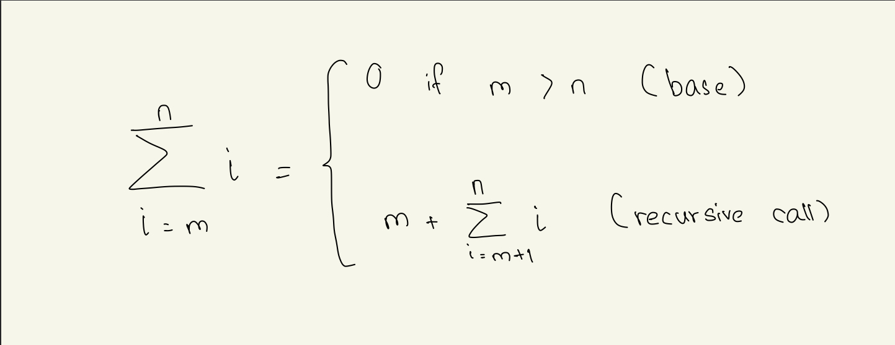
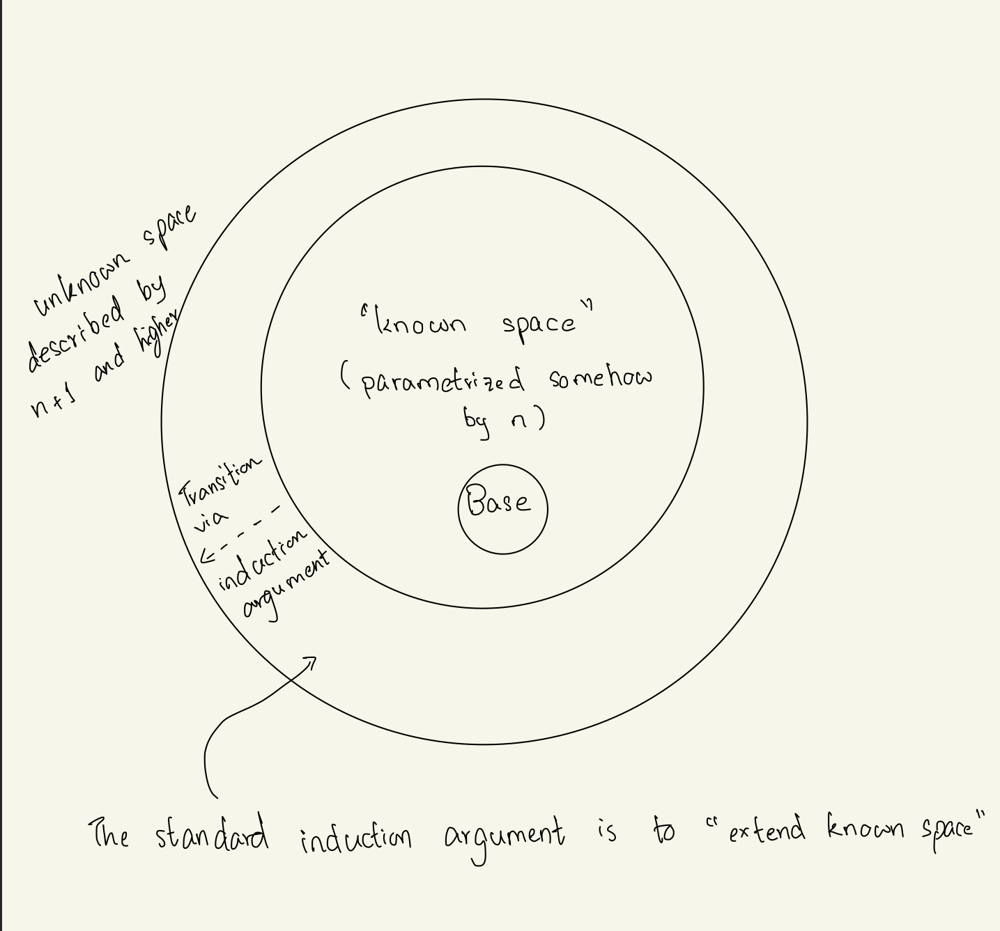

## Class: CSc 335 
## Date: Jan 31, 2023 (Tuesday)

### Kinds of programming 
#### Declarative 
- Says WHAT to do without much details on how to do it (Human efficiency)

#### Imperative 
- Step by step description of the solution (Machine efficiency)
    - eg. at the level of a C program 


### Numbers 
- To force floating point 
<br/>
```
(/ 1.0 3) = 0.3333333333333333
```

- For empty list => `'()`

### Booleans

- `#t` for `true`
- `#f` for `false`

### Functions 

- `modulo` and not `%`
```
(modulo 2 10) 
> 2
```
- `remainder` 
```
(remainder 3 5)
> 3
```

- `+` can take any amount of arguments such as 
```
(+ 1 2 3 4 5 6) 
> 21
```
- it can also take a `float` and `int` type together 
```
(+ 1.3 4)
> 5.3
```
- `(+)` will return `0` and `(*)` will return `1`. However, `(-)` and `(/)` will not evaluate and return an error below. 
    - Reason: subtraction and division needs at least 2 numbers to evaluate. 
```
arity mismatch; the expected number of arguments does not match the given number expected: at least 1
```

### Vacuous arguments 
- Also the idea that for any proposition `p(x)` 

- If you `cannot` make a counter argument, it's mostly true. 

## Worth Recalling from Discrete Math
- standard formula for integer division 
```
n/d represented as the pair (q, r) where

            n = q * d + e  where 0 <= r < d
```

** Thinking ahead: Can you use The boed conditions to help write a while loop for computing quotient and remainder ** 
- Understand how this a recursive definition - in particular that it cannot be described as a recursion on `m`

- Also review the `big picture` for induction


#### Variables 
- use the keyword `define` 
##### QUESTION - Can we use multiple define to change the value of the var the way we do in C/C++ code? (**Asked after class**)
```
Answer: cannot use `define` again to change the value of the variable like in C code below,

// C code               ;Scheme
int x = 3;              (define x 3)
x = 4;                  (define x 4)
```
**NOTE: Professor will go deeper on the above question in upcoming classes.**

## Referential Transparency (READ IT)
- every time the variable occurs in the scope, it refers to the original value defined in the beginning. 
- reduce the time to prototype 
- we have no state in this language (R5PS)